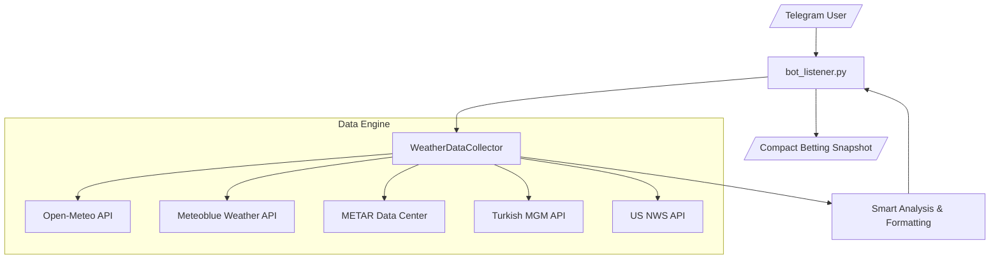

# 🌡️ PolyWeather: Real-time Weather Query & Analysis Bot

An intelligent weather information bot designed to provide ultra-fast, live meteorological data, high-fidelity forecasts, and smart trend analysis. Built for speed and accuracy, it bypasses network caching to deliver the most up-to-date reports from global weather stations.

## 🚀 Quick Start

### Requirements

- **Python 3.11+**
- Dependencies: `pip install -r requirements.txt`
- **Environment**: Configure `METEOBLUE_API_KEY` in `.env` to enable high-precision London forecasts.

### Running Locally (Windows/Linux)

```bash
# Windows
py -3.11 run.py

# Linux/VPS
python3 run.py
```

_Note: The system is currently in **Weather Query Mode**. Legacy active market monitoring and automated trading modules are suspended._

---

## 🤖 Telegram Bot Commands

| Command        | Description            | Usage                                          |
| :------------- | :--------------------- | :--------------------------------------------- |
| `/city [name]` | **Query City Weather** | Get detailed forecasts, METAR & trend analysis |
| `/id`          | **Get Chat ID**        | Retrieve your current Telegram Chat ID         |
| `/help`        | **Help**               | Display all available commands                 |

---

## ✨ Key Features

### 1. 🏛️ Multi-Source Data Fusion (High-Fidelity)

The bot aggregates data from multiple authoritative sources, layered by reliability:

| Source             | Role                    | Coverage        | Strength                                                                           |
| :----------------- | :---------------------- | :-------------- | :--------------------------------------------------------------------------------- |
| **Open-Meteo**     | Base Forecast           | Global          | Provides detailed 72-hour temperature curves for all cities.                       |
| **Meteoblue (MB)** | **Precision Consensus** | London Only     | **Traders' choice**. Aggregates multiple models; excellent for microclimates.      |
| **METAR**          | **Settlement Standard** | Global Airports | The absolute truth for Polymarket settlement; real-time station data.              |
| **NWS**            | Official (US)           | US Only         | High-fidelity forecasts for US cities, critical for extreme weather events.        |
| **MGM**            | Official (Turkey)       | Ankara          | Direct access to Turkish State Meteorological Service for local official accuracy. |

### 2. ⚡ Ultra-Fresh Data (Cache-Busting)

To counter second-by-second variations in weather betting, we implemented **Zero-Cache Technology**:

- **Micro-timestamp Tokens**: Every request includes a dynamic token to force servers to bypass CDN caches.
- **MGM Real-time Sync**: Specialized header camouflaging to bypass local Turkish API anti-crawling for Ankara.

### 3. ⏱️ Automated Trend Analysis

The bot doesn't just fetch data; it interprets it:

- **Peak Window Prediction**: Automatically identifies the timeframe when today's record is most likely to be hit.
- **Risk Profiling**: Assigns risk levels based on geographic traits (e.g., Ankara high-altitude swings, London coastal microclimates).
- **Source Attribution**: Every data point is clearly labeled ([MGM], [METAR], [MB]) to help you weigh the data.

### 4. 📊 Smart Max-Temp Tracking

Optimized for Polymarket settlement logic:

- **Local Day Filtering**: Uses city UTC offsets to strictly count observations after 00:00 local time.
- **Multi-dimension Monitoring**: Includes "Feels Like" temperatures and 24h precipitation to assist in nuanced trade decisions.

---

## 🏗️ System Architecture

PolyWeather uses a **Lightweight, Plugin-based** architecture for millisecond responses.



- **Logic Decoupling**: `weather_sources.py` handles parsing; `bot_listener.py` handles rendering.
- **Legacy Modules**: `main.py` contains the old automated trading engine. Focus has shifted to "assisted manual decision-making."

---

## 🎯 Betting Strategy Tips

1. **Check Consensus**: Compare Open-Meteo and Meteoblue (MB). Consensus usually implies higher probability.
2. **Watch the Peak**: Use `/city` frequently during predicted peak windows to catch momentum.
3. **Weighting Hierarchy**: Settlement is **METAR**; high-accuracy trend is **MB** (London); Official (NWS/MGM) is the "anchor."
4. **Geographic Risk**: Pay close attention to cities where "Bias will significantly amplify."
