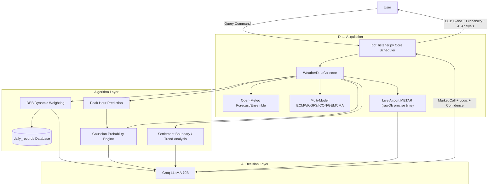

# 🌡️ PolyWeather: Intelligent Weather Quant Analysis Bot

PolyWeather is a weather analysis tool built for prediction markets like **Polymarket**. It aggregates multi-source forecasts, real-time airport METAR observations, a math-based probability engine, and AI-driven decision support to help users evaluate weather trading risks more scientifically.

---

## ✨ Core Features

### 1. 🧬 Dynamic Ensemble Blending (DEB Algorithm)

The system automatically tracks the historical performance of weather models (ECMWF, GFS, ICON, GEM, JMA) per city:

- **Error-Based Weighting**: Dynamically adjusts model weights based on their Mean Absolute Error (MAE) over the past 7 days. Lower error = higher weight.
- **Blended Forecast**: Provides a bias-corrected "DEB Blended High Temperature" recommendation.
- **Self-Learning**: Requires at least 2 days of observations before activating weight differentiation. Uses equal-weight averaging during cold start.
- **Concurrency Safe**: Built-in memory cache and file locking (fcntl) for high-concurrency group chat queries.

### 2. 🎲 Math Probability Engine (Settlement Probability)

Automatically computes the probability for each possible WU settlement integer using a Gaussian distribution fitted to the ensemble forecast:

- **Distribution Center μ**: Weighted average of DEB/multi-model median (70%) and ensemble median (30%). Auto-corrects upward when actual METAR max exceeds μ and is still rising.
- **Standard Deviation σ**: Derived from the 51-member ensemble P10/P90 (σ = (P90-P10) / 2.56).
- **Time Decay**: σ dynamically narrows based on the current time relative to the predicted peak window:
  - Before peak: σ × 1.0 (maximum uncertainty)
  - During peak window: σ × 0.7 (settling)
  - After peak: σ × 0.3 (outcome mostly determined)
- **Observed Floor**: Temperatures below the current METAR max WU value are automatically excluded (can't go back down).
- **Interval Integration**: Integrates over each WU rounding interval [N-0.5, N+0.5) to compute the probability of settling at integer N.
- **Display**: `🎲 Settlement Probability (μ=3.7): 4°C [3.5~4.5) 68% | 3°C [2.5~3.5) 32%`

### 3. 🤖 AI Deep Analysis (Groq LLaMA 3.3 70B)

Feeds wind speed, wind direction, cloud cover, solar radiation, and METAR trend data into LLaMA 70B:

- **Logical Reasoning**: 2-3 sentences analyzing airport dynamics, explicitly referencing Open-Meteo forecast and DEB blended values as benchmarks.
- **Time Awareness**: Analysis considers how much time remains until the predicted peak, judging remaining warming potential.
- **Market Call**: Explicitly states the expected peak time window and specific temperature betting range. Calls "dead market" when cooling is confirmed.
- **Confidence Score**: Quantitative 1-10 confidence rating.
- **High Availability**: Built-in auto-retry + fallback model degradation (70B → 8B) to withstand Groq API 500/503 outages.

### 4. ⏱️ Real-time Airport Observations (Zero-Cache METAR)

- **Precise Timing**: Extracts actual observation time from raw METAR text (`rawOb`), not the API's rounded `reportTime`. Accurate to the minute.
- **Live Passthrough**: Bypasses CDN caching via dynamic headers to obtain first-hand METAR reports.
- **Settlement Warning**: Automatically calculates the Wunderground settlement boundary (X.5 rounding line).
- **Anomaly Filtering**: Automatically filters out -9999 sentinel values from sources like MGM to prevent garbage data in output.

### 5. 📈 Historical Data Collection

- Includes `fetch_history.py` to retrieve up to 3 years of hourly historical weather data (temperature, humidity, radiation, pressure, 10+ dimensions), providing data foundation for future ML models (XGBoost/MOS).

---

## ⚡ Deployment

### Requirements

- **Python 3.11+**
- Install dependencies: `pip install -r requirements.txt`
- **Environment Variables**: Set `TELEGRAM_BOT_TOKEN` and `GROQ_API_KEY` in your `.env` file.

### VPS Quick Deployment

1. Clone the repository and install dependencies.
2. Configure your `.env` file.
3. Use the following script for one-click updates and restarts:

```bash
cat > ~/update.sh << 'EOF'
#!/bin/bash
cd ~/PolyWeather
git fetch origin
git reset --hard origin/main
pkill -f bot_listener.py
sleep 1
nohup python3 bot_listener.py > bot.log 2>&1 &
echo "✅ PolyWeather Restarted!"
EOF
chmod +x ~/update.sh
```

---

## 🕹️ Bot Commands

| Command             | Description                                                                      |
| :------------------ | :------------------------------------------------------------------------------- |
| `/city [city_name]` | Get weather analysis, settlement probabilities, METAR tracking, and AI insights. |
| `/id`               | View the Chat ID of the current conversation.                                    |
| `/help`             | Display help information.                                                        |

### Supported Cities

`lon` (London), `par` (Paris), `ank` (Ankara), `nyc` (New York), `chi` (Chicago), `dal` (Dallas), `mia` (Miami), `atl` (Atlanta), `sea` (Seattle), `tor` (Toronto), `sel` (Seoul), `ba` (Buenos Aires), `wel` (Wellington), etc.

---

## 🏗️ Architecture



---

## 💡 Trading Tips

1. **Watch Settlement Probability**: The probability engine is math-based and more objective than AI judgment. When one temperature has > 65% probability, the direction is relatively clear.
2. **Observe Time Decay**: Probabilities auto-lock as time progresses. After peak hours, the engine narrows σ dramatically, concentrating results around the observed max.
3. **Reference DEB Blended Value**: When models diverge, the DEB corrected value is usually more reliable than any single forecast.
4. **Observe AI Confidence**: A score below 5 indicates high uncertainty—consider staying on the sidelines.
5. **Watch Settlement Boundaries**: When the observed high is near X.5, be wary of rounding jumps during WU settlements.
6. **Distribution Center μ**: The μ value shown in the probability display represents the algorithm's expected most likely actual high temperature—compare it directly with the Polymarket odds.

---

_Updated 2026-02-27_
