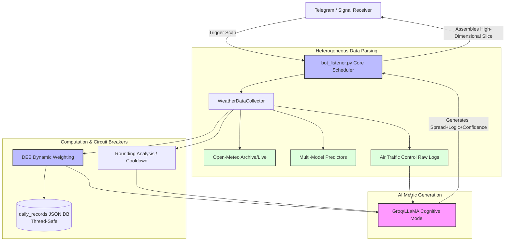

# 🌡️ PolyWeather: Quantitative Weather Trading & AI Command Center

![Banner Placeholder: Futuristic Weather Trading System]

PolyWeather is not just a simple weather bot. It is an **institutional-grade weather quantitative trading assistant** designed for prediction markets like **Polymarket** and other weather derivatives. By connecting directly to global aviation weather stations (METAR) without CDN caching, integrating our Dynamic Ensemble Blending (DEB) model, extracting real-time micro-climate features, and stripping away human emotion via the massive LLaMA 70B AI model, it provides you with rapid, objective, and lethal trading signals.

---

## 🚀 Core Features Matrix

### 1. 🧠 Proprietary Moat: Dynamic Ensemble Blending (DEB)

Traditional weather bots simply calculate rigid averages out of numerical models like ECMWF and GFS. PolyWeather introduces a **dynamic tracking and backtesting algorithm**:

- **Adaptive Weight Evolution**: By looking back at the Mean Absolute Error (MAE) of each model over the past 7-14 days at specific airports (e.g., Esenboğa Airport in Ankara), the system actively penalizes and rewards the 5 major NWP models (ECMWF, GFS, ICON, GEM, JMA) per query.
- **High-Concurrency Thread-Safe Database**: Built on an underlying memory singleton cache and system-level file locks (`fcntl Lock`), PolyWeather guarantees 0 disk I/O bottlenecks and microsecond response times—even when bombarded by 500+ users checking the weather at the exact same millisecond.

### 2. 🤖 AI Trading Veteran (Groq AI Agent)

The system no longer outputs boring templates. We feed all **complex thermodynamic parameters** (wind direction/speed matrix, cooling inertia, rounding resistance) into LLaMA 3.3 70B via the lightning-fast Groq API:

- **🧊 Forced Objectivity**: With strict logical constraints built into the prompt, the AI accurately evaluates scenarios like "15kt cold northerly winds at 3 PM, coupled with radiation dropping below 50W/m²" and immediately calls "Dead market: peak passed, bets frozen."
- **🎯 Quantitative Confidence Scoring**: It outputs a 1-10 confidence score with strong guidance. High confidence means an "immediate signal to build positions," whereas low confidence warns of a chaotic market full of wind/rain uncertainties.

### 3. ⏱️ Absolute Live Dominance (Zero-Cache METAR Extraction)

In the meat grinder of Polymarket weather settlements, **a 1-minute delay can mean a 100% loss of your principal**.

- PolyWeather forces anti-cache dynamic timestamps on every single API call, bypassing all proxy network (CDN) stagnant cache pools.
- It doesn't just extract "how many degrees it is now." It analyzes the exact decimal point for Settlement Risk (including the deadly X.5 Wunderground roundup boundaries).

### 4. 📈 High-Frequency Data Mining Foundation

Built-in `fetch_history.py` native spider system.

- One click to pull down hundreds of thousands of rows of hourly historical physics sandbox feature matrices (over 10 dimensions including humidity, shortwave radiation, surface pressure) for any global benchmark city across the past 3-5 years.
- Infinite ammunition ready for our next-generation XGBoost / LightGBM Machine Learning Model Output Statistics (MOS) calibration.

---

## ⚡ Deployment & Operations

### Environment Architecture

- **Core Engine**: Python 3.11+ (Strict Compliance)
- **Dependency Stack**: `pip install -r requirements.txt`
- **Volume Mounts**: Minimal configuration. Just register your `TELEGRAM_BOT_TOKEN` and `GROQ_API_KEY` inside `.env` to summon the AI.

### Recommended 1-Click VPS Production Launch

**Step 1: Build & Register**

```bash
git clone https://github.com/yangyuan-zhen/PolyWeather.git
cd PolyWeather
pip install -r requirements.txt
cp .env.example .env  # Be sure to insert your secure API keys
```

**Step 2: Daemon Updater Assembly**
Set up an automated keep-alive script to integrate updates, conflict-resolution, and hot-swaps all in one push:

```bash
cat > ~/update.sh << 'EOF'
#!/bin/bash
cd ~/PolyWeather
git fetch origin
git reset --hard origin/main
pkill -f run.py
pkill -f bot_listener.py
sleep 1
nohup python3 bot_listener.py > bot.log 2>&1 &
echo "✅ PolyWeather Quant Terminal up and loaded with the latest modules!"
EOF
chmod +x ~/update.sh
```

**Daily Operations Command (Push & Play):**

```bash
~/update.sh
```

> One command to wipe Git conflicts, execute warm/cold reboots, and clean logs.

---

## 🕹️ Telegram Command Center

| Tactical Command    | Trigger Action      | Module Feedback                                                                                                                                        |
| :------------------ | :------------------ | :----------------------------------------------------------------------------------------------------------------------------------------------------- |
| `/city [City Code]` | **Reconnaissance**  | Initiates full-dimension weather sweep. Returns DEB-weighted forecast, METAR tracking, rounding risk warnings, and AI quantitative trading conclusion. |
| `/id`               | **Identity Ping**   | Maps the current comm channel (Chat ID).                                                                                                               |
| `/help`             | **Terminal Manual** | Pulls the latest command set.                                                                                                                          |

### Target Arenas

From low-risk setups in the Middle East/Africa to high-latency slippage arenas in North America, PolyWeather embeds precise airport deviation models (Risk Profiles):
`lon`(London EGLC), `par`(Paris LFPG), `ank`(Ankara LTAC), `nyc`(New York KLGA), `chi`(Chicago KORD), `ba`(Buenos Aires SAEZ)... and more.

> **Fire Examples:**
> `/city Paris`
> `/city london`
> `/city ba`

---

## 🏗️ System Architecture Anatomy



---

## 🎯 Trader's Playbook

As a Commander of PolyWeather, etch these rules into your DNA:

1. 🧬 **Trust the DEB Baseline**: Instead of blindly believing an extreme forecast from ECMWF or GFS, stare at the `DEB Blended Forecast` on line one. It is the system's re-calibrated truth, forged after absorbing the punishing MAE beating those models took over the past 7 days.
2. 🎯 **Respect the AI Confidence Red Line**: If the AI returns a `Confidence: ≤ 4/10`, it means the model's delay is clashing heavily with real-time airport headwinds. **Chop your gambling hands off immediately.** You are in a high-risk chaotic zone.
3. ⚖️ **Fear the X.5 Rounding Abyss**: Polymarket weather settles on integer values (rounded via Wunderground logic). When the terminal blinks `⚖️ Settlement Boundary... crossed the rounding line`, this is where liquidity dries up and slippage becomes most predatory.
4. 🌙 **Identify False Positives (Warm Advection radar)**: If the temperature ignores the sun and spikes during a low-radiation night, the system triggers a `🌙 Warm Advection Anomaly`. This mechanism frequently hands you the golden "LONG" signal (shattering the original forecast's ceiling) exactly when the rest of the market is betting NO.

---

_The weather changes. Our edge remains. | Updated 2026_
