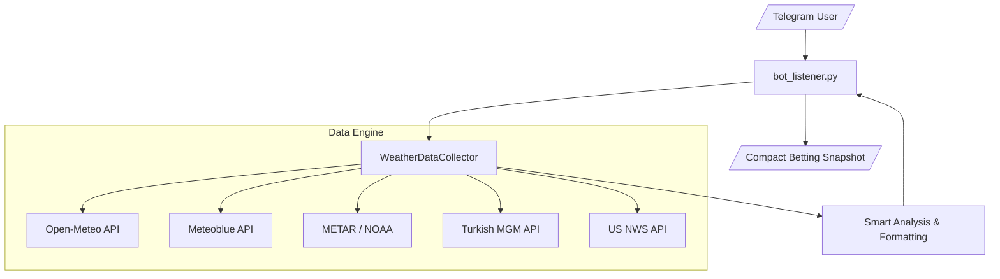

# 🌡️ PolyWeather: Real-time Weather Query & Analysis Bot

An intelligent weather bot for prediction markets and professional weather betting. Fetches ultra-fresh data directly from global weather stations, bypassing CDN caches, and provides automated trend analysis in plain language.

## 🚀 Quick Start

### Requirements

- **Python 3.11+**
- Dependencies: `pip install -r requirements.txt`
- **Environment Variables**: Set `TELEGRAM_BOT_TOKEN` in `.env` (required). Optionally set `METEOBLUE_API_KEY` for London high-precision forecasts.

### VPS Deployment (Recommended)

**First-time setup:**

```bash
git clone https://github.com/yangyuan-zhen/PolyWeather.git
cd PolyWeather
pip install -r requirements.txt
cp .env.example .env  # Edit .env with your Token and API Keys
```

**Create one-click update script (run once):**

```bash
cat > ~/update.sh << 'EOF'
#!/bin/bash
cd ~/PolyWeather
git fetch origin
git reset --hard origin/main
pkill -f run.py
pkill -f bot_listener.py
sleep 1
nohup python3 run.py > bot.log 2>&1 &
echo "✅ Updated and restarted!"
EOF
chmod +x ~/update.sh
```

**Daily updates (after each code push):**

```bash
~/update.sh
```

> One command: pull latest code → kill old process → start new process. No branch conflict handling needed.

### Local Development (Windows)

```bash
py -3.11 run.py
```

> Local machine is for editing code and Git push only. IDE import errors are expected (dependencies not installed locally) and do not affect VPS operation.

---

## 🤖 Telegram Bot Commands

| Command        | Description            | Usage                                          |
| :------------- | :--------------------- | :--------------------------------------------- |
| `/city [name]` | **Query City Weather** | Get detailed forecasts, METAR & trend analysis |
| `/id`          | **Get Chat ID**        | Retrieve your current Telegram Chat ID         |
| `/help`        | **Help**               | Display all available commands                 |

### Supported Cities

| City | Aliases | METAR Station | Extra Sources |
|:---|:---|:---|:---|
| London | `lon`, `伦敦` | EGLC (City Airport) | Meteoblue |
| Paris | `par`, `巴黎` | LFPG (Charles de Gaulle) | — |
| Ankara | `ank`, `安卡拉` | LTAC (Esenboğa) | MGM |
| New York | `nyc`, `ny`, `纽约` | KLGA (LaGuardia) | NWS |
| Chicago | `chi`, `芝加哥` | KORD (O'Hare) | NWS |
| Dallas | `dal`, `达拉斯` | KDAL (Love Field) | NWS |
| Miami | `mia`, `迈阿密` | KMIA (International) | NWS |
| Atlanta | `atl`, `亚特兰大` | KATL (Hartsfield-Jackson) | NWS |
| Seattle | `sea`, `西雅图` | KSEA (Sea-Tac) | NWS |
| Toronto | `tor`, `多伦多` | CYYZ (Pearson) | — |
| Seoul | `sel`, `首尔` | RKSI (Incheon) | — |
| Buenos Aires | `ba`, `布宜诺斯艾利斯` | SAEZ (Ezeiza) | — |
| Wellington | `wel`, `惠灵顿` | NZWN (Wellington) | — |

### Example

```
/city 巴黎
/city london
/city par
```

---

## ✨ Key Features

### 1. 🏛️ Multi-Source Data Fusion

| Source             | Role                    | Coverage        | Strength                                                                           |
| :----------------- | :---------------------- | :-------------- | :--------------------------------------------------------------------------------- |
| **Open-Meteo**     | Base Forecast           | Global          | 72-hour hourly temperature curves, sunrise/sunset times                            |
| **Meteoblue (MB)** | **Precision Consensus** | London Only     | Multi-model aggregation; excellent for microclimates                               |
| **METAR**          | **Settlement Standard** | Global Airports | Polymarket settlement source; real-time airport observations                       |
| **NWS**            | Official (US)           | US Only         | US National Weather Service high-fidelity forecasts                                |
| **MGM**            | Official (Turkey)       | Ankara Only     | Turkish State Met Service: pressure, cloud cover, feels-like, 24h rainfall         |

### 2. ⚡ Ultra-Fresh Data (Zero-Cache)

- **Dynamic Timestamps**: Every API request includes a unique token to force servers to bypass CDN caches.
- **MGM Real-time Sync**: Specialized header camouflaging and timezone correction for Turkish API.

### 3. 🧠 Smart Trend Analysis (Plain Language)

The bot generates human-readable insights automatically:

- **🚨 Forecast Breakthrough Alerts**: Detects when METAR observed max exceeds all forecast highs.
- **⏱️ Peak Window Prediction**: Identifies the exact hours when today's high is expected.
- **🌬️ Wind Direction Cross-Validation**: Compares METAR and MGM wind data; alerts on conflicts (>90° difference).
- **☁️ Cloud Impact Analysis**: Evaluates cloud cover's effect on warming potential.
- **📉 Pressure Analysis**: Low pressure indicates warm/moist air passage.
- **🌧️ Rain Detection**: Cross-validates METAR weather codes with actual rainfall data to avoid false positives.
- **📊 Max Temperature Time Tracking**: Shows exactly when the daily high was recorded (e.g., `最高: 12°C @14:20`).

### 4. 📊 Risk Profiling

Every city has a data bias risk profile based on airport-to-city-center distance:

- 🔴 **High Risk**: Seoul (48.8km), Chicago (25.3km) — large bias expected
- 🟡 **Medium Risk**: Ankara (24.5km), Paris (25.2km), Dallas, Buenos Aires — systematic bias
- 🟢 **Low Risk**: London (12.7km), Wellington (5.1km) — reliable data

---

## 🏗️ System Architecture



- **Logic Decoupling**: `weather_sources.py` handles data fetching & parsing; `bot_listener.py` handles analysis & rendering.
- **City Config**: `city_risk_profiles.py` contains all METAR station mappings and risk assessments.

---

## 🎯 Betting Strategy Tips

1. **Check Consensus**: Compare Open-Meteo, Meteoblue (MB), and NWS/MGM forecasts.
2. **Watch the Peak Window**: Use `/city` frequently during predicted peak hours.
3. **Settlement Priority**: Settlement is always based on **METAR** data.
4. **Geographic Risk**: Pay attention to bias warnings, especially for high-risk cities.
5. **Wind Conflicts**: When METAR and MGM show opposite wind directions, expect temperature volatility.

---

_Last updated: 2026-02-18_
