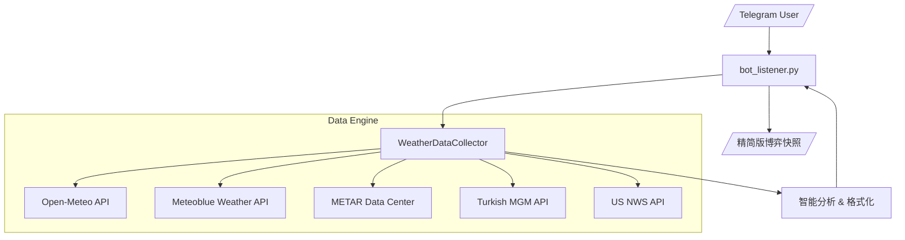

# 🌡️ PolyWeather: 实时天气查询与分析机器人

一个智能天气信息机器人，专为提供超快、实时的气象数据、高保真预报和智能趋势分析而设计。通过绕过网络缓存，直接从全球气象站获取最新数据。

## 🚀 快速开始

### 环境要求

- **Python 3.11+**
- 依赖安装: `pip install -r requirements.txt`
- **环境变量**: 需在 `.env` 中配置 `METEOBLUE_API_KEY` 以激活伦敦高精度预报。

### VPS 部署 (推荐)

**首次部署：**

```bash
git clone https://github.com/yangyuan-zhen/PolyWeather.git
cd PolyWeather
pip install -r requirements.txt
cp .env.example .env  # 编辑 .env 填入你的 Token 和 API Key
```

**创建一键更新脚本（只需执行一次）：**

```bash
cat > ~/update.sh << 'EOF'
#!/bin/bash
cd ~/PolyWeather
git fetch origin
git reset --hard origin/main
pkill -f run.py
pkill -f bot_listener.py
sleep 1
nohup python3 run.py > bot.log 2>&1 &
echo "✅ 已更新并重启！"
EOF
chmod +x ~/update.sh
```

**日常更新（每次代码推送后）：**

```bash
~/update.sh
```

> 一条命令完成：拉取最新代码 → 杀旧进程 → 启动新进程。无需手动处理分支冲突。

### 本地开发 (Windows)

```bash
py -3.11 run.py
```

> 本地笔记本**不需要安装 Python**，只用来编辑代码和 Git 推送。IDE 的 import 报错是因为本地没装依赖，不影响 VPS 运行。

_注意：系统当前处于 **天气查询模式**。主动市场监控和自动交易模块已暂停。_

---

## 🤖 Telegram 机器人指令

| 指令           | 功能             | 说明                             |
| :------------- | :--------------- | :------------------------------- |
| `/city [城市]` | **查询城市天气** | 获取详细预报、机场实测与趋势分析 |
| `/id`          | **获取 Chat ID** | 获取当前 Telegram 聊天 ID        |
| `/help`        | **帮助**         | 显示所有可用指令                 |

### /city 指令示例

```
/city 伦敦
```

---

## ✨ 核心功能

### 1. 🏛️ 多源数据融合 (Multi-Source Fusion)

机器人聚合了全球最权威的几个数据源，并按权重进行分层：

| 数据源             | 数据角色       | 覆盖范围   | 优势                                             |
| :----------------- | :------------- | :--------- | :----------------------------------------------- |
| **Open-Meteo**     | 基础预测       | 全球       | 提供所有城市的 72 小时精细化温度曲线             |
| **Meteoblue (MB)** | **高精度共识** | 仅限伦敦   | **交易员首选**。聚合多家模型，对微气候处理极佳   |
| **METAR**          | **结算标准**   | 全球机场   | Polymarket 结算参考的绝对真理，实时机场观测      |
| **NWS**            | 官方预测(美)   | 仅限美国   | 美国国家气象局，对美国城市的极端天气预判准确     |
| **MGM**            | 官方预测(土)   | 仅限安卡拉 | 土耳其气象局，提供安卡拉 Esenboğa 机场的官方数据 |

### 2. ⚡ 超新鲜数据 (Cache-Busting)

为了应对气象博弈中秒级的变化，我们实现了 **0 缓存技术**：

- **微秒级令牌**：每个 API 请求都附带动态时间戳，强制气象服务器绕过 CDN 缓存返回最新值。
- **MGM 实时同步**：针对土耳其 MGM API 做了专门的 Header 伪装和时区校正。

### 3. ⏱️ 自动态势分析

机器人不仅仅搬运数据，它还会进行逻辑加工：

- **峰值时刻预测**：自动计算今天气温最高点出现的概率窗口（如：14:00 - 15:00）。
- **风险等级 (Risk-Profile)**：根据地理特征（如安卡拉的高原温差、伦敦的近海微气候）自动分配风险等级。
- **数据溯源**：报表明确标注每个数字的来源（[MGM], [METAR], [MB]）。

### 4. 📊 智能最高温追踪

针对 Polymarket 的结算逻辑进行优化：

- **当地日历日过滤**：基于城市 UTC 偏移，严格统计当地时间 00:00 之后的实测最高温。
- **多维度监测**：集成体感温度 (`feels_like`) 和 24h 累计降雨量，辅助多维度判断。

---

## 🏗️ 系统架构

本项目采用 **“轻量化、插件式”** 架构，旨在实现毫秒级响应。



- **逻辑解耦**：`weather_sources.py` 负责外部数据的解析；`bot_listener.py` 负责消息模板渲染。
- **遗留模块说明**：项目根目录下的 `main.py` 包含旧版本的自动交易引擎。目前重心在“手动辅助决策”，如需开启请查阅 [MARKET_DISCOVERY_ZH.md](./MARKET_DISCOVERY_ZH.md)。

---

## 🎯 博弈策略提示

1. **检查模型共识**：查看 Open-Meteo 和 Meteoblue (MB) 是否达成共识。
2. **关注峰值窗口**：在预测的峰值时段多次使用 `/city` 刷新。
3. **数据权重优先级**：结算以 **METAR** 为准，趋势预测以 **MB** 为准（仅限伦敦）。
4. **地理风险评估**：重点关注提示中的“偏差会显著放大”警告（如安卡拉、伦敦）。
