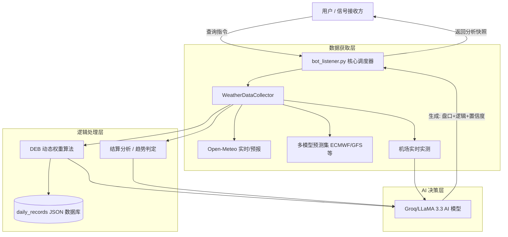

# 🌡️ PolyWeather: 智能天气量化分析机器人

PolyWeather 是一款专为 **Polymarket** 等预测市场打造的天气分析工具。它通过聚合多源气象预报、实时机场 METAR 观测，并引入 AI 决策支持，帮助用户更科学地评估天气博弈风险。

---

## ✨ 核心功能

### 1. � 动态权重集合预报 (DEB 算法)

系统会自动追踪各个气象模型（ECMWF, GFS, ICON, GEM, JMA）在特定城市的历史表现：

- **误差加权**：根据过去 7 天的平均绝对误差（MAE），动态调整各模型的权重。
- **融合预报**：给出经过历史偏差修正后的“融合最高温”建议值。
- **并发优化**：内置单例缓存与文件锁，支持高并发查询，确保数据读写安全。

### 2. 🤖 AI 智能分析 (Groq LLaMA 3.3)

集成 LLaMA 70B 大模型，对瞬息万变的气象数据进行解读：

- **逻辑推演**：综合考虑风速、风向、云量、太阳辐射等动力因子，判断温度走势。
- **置信度评分**：针对当前盘口给出 1-10 分的置信度参考。
- **自动冷却判定**：当观测到气温明显回落或已过预报峰值时，AI 会给出明确的死盘结论。

### 3. ⏱️ 实时机场观测 (Zero-Cache METAR)

- **实时穿透**：通过动态请求头绕过 CDN 缓存，获取机场第一手 METAR 报文。
- **结算预警**：自动计算 Wunderground 结算边界（X.5 进位线），提醒潜在波动。

### 4. 📈 历史数据采集

- 提供 `fetch_history.py` 脚本，可一键获取各城市过去 3 年的小时级历史气象数据，为后续算法开发提供支持。

---

## ⚡ 部署说明

### 环境要求

- **Python 3.11+**
- 依赖安装: `pip install -r requirements.txt`
- **环境变量**: 在 `.env` 中设置 `TELEGRAM_BOT_TOKEN` 和 `GROQ_API_KEY`。

### VPS 快捷部署

1. 克隆仓库并安装依赖。
2. 配置 `.env` 文件。
3. 使用以下脚本实现一键更新与重启：

```bash
cat > ~/update.sh << 'EOF'
#!/bin/bash
cd ~/PolyWeather
git fetch origin
git reset --hard origin/main
pkill -f bot_listener.py
sleep 1
nohup python3 bot_listener.py > bot.log 2>&1 &
echo "✅ PolyWeather 已重启！"
EOF
chmod +x ~/update.sh
```

---

## 🕹️ 机器人指令

| 指令             | 说明                                       |
| :--------------- | :----------------------------------------- |
| `/city [城市名]` | 获取深度气象分析、实测追踪及 AI 决策建议。 |
| `/id`            | 查看当前对话的 Chat ID。                   |
| `/help`          | 显示说明信息。                             |

### 支持城市示例

`lon`(伦敦)、`par`(巴黎)、`ank`(安卡拉)、`nyc`(纽约)、`chi`(芝加哥)、`ba`(布宜诺斯艾利斯) 等。

---

## 🏗️ 系统架构



---

## 💡 交易提示

1. **参考 DEB 融合值**：当多模型分歧较大时，DEB 的修正值通常比单一预报更具参考意义。
2. **观察 AI 置信度**：置信度低于 5 分时，说明当前气象环境处于高度不确定状态。
3. **注意结算边界**：实测最高温接近 X.5 时，需警惕 Wunderground 结算时的进位跳动。

---

_更新于 2026_
