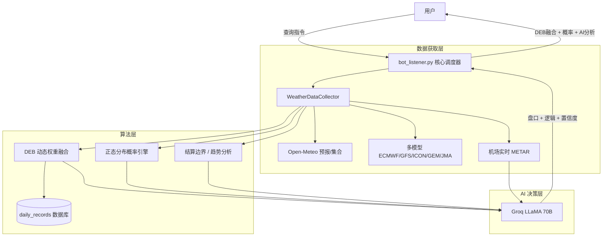

# 🌡️ PolyWeather: 智能天气量化分析机器人

PolyWeather 是一款专为 **Polymarket** 等预测市场打造的天气分析工具。它通过聚合多源气象预报、实时机场 METAR 观测，并引入数学概率模型与 AI 决策支持，帮助用户更科学地评估天气博弈风险。

---

## ✨ 核心功能

### 1. 🧬 动态权重集合预报 (DEB 算法)

系统会自动追踪各个气象模型（ECMWF, GFS, ICON, GEM, JMA）在特定城市的历史表现：

- **误差加权**：根据过去 7 天的平均绝对误差（MAE），动态调整各模型的权重。误差越小的模型，话语权越大。
- **融合预报**：给出经过历史偏差修正后的"DEB 融合最高温"建议值。
- **自学习机制**：系统需要至少 2 天的实测记录才会启动权重分化。冷启动期间以等权平均过渡。
- **并发优化**：内置内存缓存与文件锁 (fcntl)，支持高并发群聊查询。

### 2. 🎲 数学概率引擎 (Settlement Probability)

基于集合预报的正态分布拟合，自动计算每个 WU 结算整数温度的概率：

- **原理**：用 51 成员集合预报的 P10/P90 反推高斯分布标准差（σ），以 DEB/多模型中位数（70% 权重）和集合中位数（30%）的加权均值为分布中心（μ）。
- **区间积分**：对每个 WU 取整区间 [N-0.5, N+0.5) 做正态积分，得到结算落入该整数的概率。
- **展示格式**：`🎲 结算概率 (μ=3.7)：4°C [3.5~4.5) 68% | 3°C [2.5~3.5) 32%`

### 3. 🤖 AI 深度分析 (Groq LLaMA 3.3 70B)

将风速、风向、云量、太阳辐射、METAR 趋势等全部投喂给 LLaMA 70B 大模型：

- **逻辑推演**：用 2-3 句话深度分析机场动力因子对升温的促进/阻碍，判断最终能否达到预报值。
- **盘口判定**：明确给出预计最热时段和具体博弈温度区间。降温确认后直接给出死盘结论。
- **置信度评分**：1-10 分量化置信度参考。
- **高可用保障**：内置自动重试 + 备用模型降级机制（70B → 8B），抵御 Groq API 503/500 故障。

### 4. ⏱️ 实时机场观测 (Zero-Cache METAR)

- **实时穿透**：通过动态请求头绕过 CDN 缓存，获取机场第一手 METAR 报文。
- **结算预警**：自动计算 Wunderground 结算边界（X.5 进位线），提醒潜在波动。

### 5. 📈 历史数据采集

- 提供 `fetch_history.py` 脚本，可一键获取各城市过去 3 年的小时级历史气象数据（温度、湿度、辐射、气压等 10+ 维度），为后续机器学习模型（XGBoost/MOS）提供数据基础。

---

## ⚡ 部署说明

### 环境要求

- **Python 3.11+**
- 依赖安装: `pip install -r requirements.txt`
- **环境变量**: 在 `.env` 中设置 `TELEGRAM_BOT_TOKEN` 和 `GROQ_API_KEY`。

### VPS 快捷部署

1. 克隆仓库并安装依赖。
2. 配置 `.env` 文件。
3. 使用以下脚本实现一键更新与重启：

```bash
cat > ~/update.sh << 'EOF'
#!/bin/bash
cd ~/PolyWeather
git fetch origin
git reset --hard origin/main
pkill -f bot_listener.py
sleep 1
nohup python3 bot_listener.py > bot.log 2>&1 &
echo "✅ PolyWeather 已重启！"
EOF
chmod +x ~/update.sh
```

---

## 🕹️ 机器人指令

| 指令             | 说明                                                 |
| :--------------- | :--------------------------------------------------- |
| `/city [城市名]` | 获取深度气象分析、结算概率、实测追踪及 AI 决策建议。 |
| `/id`            | 查看当前对话的 Chat ID。                             |
| `/help`          | 显示说明信息。                                       |

### 支持城市示例

`lon`(伦敦)、`par`(巴黎)、`ank`(安卡拉)、`nyc`(纽约)、`chi`(芝加哥)、`dal`(达拉斯)、`mia`(迈阿密)、`atl`(亚特兰大)、`sea`(西雅图)、`tor`(多伦多)、`sel`(首尔)、`ba`(布宜诺斯艾利斯)、`wel`(惠灵顿) 等。

---

## 🏗️ 系统架构



---

## 💡 交易提示

1. **紧盯结算概率**：概率引擎基于数学模型计算，比 AI 的主观判断更客观。当某个温度概率 > 65%，说明方向较为明确。
2. **参考 DEB 融合值**：当多模型分歧较大时，DEB 的修正值通常比单一预报更具参考意义。
3. **观察 AI 置信度**：置信度低于 5 分时，说明当前气象环境处于高度不确定状态，建议观望。
4. **注意结算边界**：实测最高温接近 X.5 时，需警惕 Wunderground 结算时的进位跳动。
5. **分布中心 μ**：概率展示中的 μ 值代表算法预期的最可能实际最高温，可与 Polymarket 盘口价格直接对比。

---

_更新于 2026-02-27_
