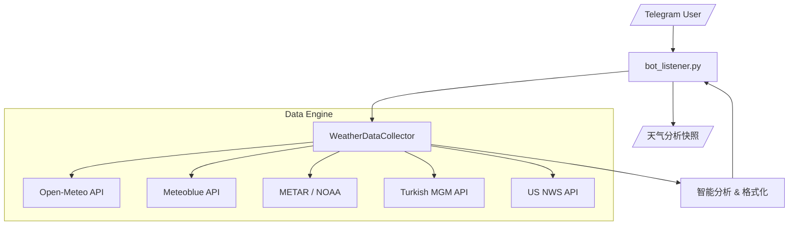

# 🌡️ PolyWeather: 实时天气查询与分析机器人

专为预测市场和天气博弈设计的智能天气机器人。通过绕过 CDN 缓存直接从全球气象站获取最新数据，并提供通俗易懂的自动趋势分析。

## 🚀 快速开始

### 环境要求

- **Python 3.11+**
- 依赖安装: `pip install -r requirements.txt`
- **环境变量**: 在 `.env` 中设置 `TELEGRAM_BOT_TOKEN`（必需）。可选设置 `METEOBLUE_API_KEY` 以激活伦敦高精度预报。

### VPS 部署 (推荐)

**首次部署：**

```bash
git clone https://github.com/yangyuan-zhen/PolyWeather.git
cd PolyWeather
pip install -r requirements.txt
cp .env.example .env  # 编辑 .env 填入你的 Token 和 API Key
```

**创建一键更新脚本（只需执行一次）：**

```bash
cat > ~/update.sh << 'EOF'
#!/bin/bash
cd ~/PolyWeather
git fetch origin
git reset --hard origin/main
pkill -f run.py
pkill -f bot_listener.py
sleep 1
nohup python3 run.py > bot.log 2>&1 &
echo "✅ 已更新并重启！"
EOF
chmod +x ~/update.sh
```

**日常更新（每次代码推送后）：**

```bash
~/update.sh
```

> 一条命令完成：拉取最新代码 → 杀旧进程 → 启动新进程。无需手动处理分支冲突。

### 本地开发 (Windows)

```bash
py -3.11 run.py
```

> 本地笔记本**不需要安装依赖**，只用来编辑代码和 Git 推送。IDE 的 import 报错是因为本地没装依赖，不影响 VPS 运行。

_注意：系统当前处于 **天气查询模式**。主动市场监控和自动交易模块已暂停。_

---

## 🤖 Telegram 机器人指令

| 指令           | 功能             | 说明                             |
| :------------- | :--------------- | :------------------------------- |
| `/city [城市]` | **查询城市天气** | 获取详细预报、机场实测与趋势分析 |
| `/id`          | **获取 Chat ID** | 获取当前 Telegram 聊天 ID        |
| `/help`        | **帮助**         | 显示所有可用指令                 |

### 支持的城市

| 城市 | 缩写/别名 | METAR 机场 | 额外数据源 |
|:---|:---|:---|:---|
| 伦敦 London | `lon`, `伦敦` | EGLC (City Airport) | Meteoblue |
| 巴黎 Paris | `par`, `巴黎` | LFPG (Charles de Gaulle) | — |
| 安卡拉 Ankara | `ank`, `安卡拉` | LTAC (Esenboğa) | MGM |
| 纽约 New York | `nyc`, `ny`, `纽约` | KLGA (LaGuardia) | NWS |
| 芝加哥 Chicago | `chi`, `芝加哥` | KORD (O'Hare) | NWS |
| 达拉斯 Dallas | `dal`, `达拉斯` | KDAL (Love Field) | NWS |
| 迈阿密 Miami | `mia`, `迈阿密` | KMIA (International) | NWS |
| 亚特兰大 Atlanta | `atl`, `亚特兰大` | KATL (Hartsfield-Jackson) | NWS |
| 西雅图 Seattle | `sea`, `西雅图` | KSEA (Sea-Tac) | NWS |
| 多伦多 Toronto | `tor`, `多伦多` | CYYZ (Pearson) | — |
| 首尔 Seoul | `sel`, `首尔` | RKSI (Incheon) | — |
| 布宜诺斯艾利斯 Buenos Aires | `ba`, `布宜诺斯艾利斯` | SAEZ (Ezeiza) | — |
| 惠灵顿 Wellington | `wel`, `惠灵顿` | NZWN (Wellington) | — |

### 使用示例

```
/city 巴黎
/city london
/city par
```

---

## ✨ 核心功能

### 1. 🏛️ 多源数据融合

| 数据源             | 数据角色       | 覆盖范围   | 优势                                                 |
| :----------------- | :------------- | :--------- | :--------------------------------------------------- |
| **Open-Meteo**     | 基础预测       | 全球       | 72 小时逐小时温度曲线、日出日落时间                  |
| **Meteoblue (MB)** | **高精度共识** | 仅限伦敦   | 聚合多家模型，对微气候处理极佳                       |
| **METAR**          | **结算标准**   | 全球机场   | Polymarket 结算参考的绝对真理，实时机场观测           |
| **NWS**            | 官方预测(美)   | 仅限美国   | 美国国家气象局高精度预报                             |
| **MGM**            | 官方预测(土)   | 仅限安卡拉 | 土耳其气象局：气压、云量、体感温度、24h 降水         |

### 2. ⚡ 超新鲜数据 (零缓存)

- **动态时间戳**：每个 API 请求都附带唯一令牌，强制服务器绕过 CDN 缓存。
- **MGM 实时同步**：针对土耳其 MGM API 做了专门的 Header 伪装和时区校正。

### 3. 🧠 智能趋势分析（通俗语言）

机器人自动生成人类可读的分析洞察：

- **🚨 预报击穿预警**：当 METAR 实测最高温超过所有预报时自动警报。
- **⏱️ 峰值时段预测**：精确预测当日最高温出现的时间窗口。
- **🌬️ 风向交叉验证**：同时对比 METAR 和 MGM 风向数据，差异超 90° 自动告警。
- **🍃 风速分析**：标注风速并结合风向判断对温度的影响。
- **☁️ 云层遮挡分析**：评估云量对升温潜力的影响（晴天/多云/阴天）。
- **📉 气压分析**：低气压意味着暖湿气流过境，有利升温。
- **🌧️ 降雨检测**：交叉验证 METAR 天气代码和实际降水量，避免误报。
- **📊 最高温时间追踪**：精确显示每日最高温出现的时间（如 `最高: 12°C @14:20`）。

### 4. 📊 风险等级

每个城市都有基于机场-市区距离的数据偏差风险档案：

- 🔴 **高危**：首尔 (48.8km)、芝加哥 (25.3km) — 偏差大
- 🟡 **中危**：安卡拉 (24.5km)、巴黎 (25.2km)、达拉斯、布宜诺斯艾利斯 — 有系统偏差
- 🟢 **低危**：伦敦 (12.7km)、惠灵顿 (5.1km) — 数据靠谱

---

## 🏗️ 系统架构



- **逻辑解耦**：`weather_sources.py` 负责数据获取与解析；`bot_listener.py` 负责分析与渲染。
- **城市配置**：`city_risk_profiles.py` 包含所有 METAR 机场映射和风险评估。

---

## 🎯 博弈策略提示

1. **检查模型共识**：对比 Open-Meteo、Meteoblue (MB) 和 NWS/MGM 的预报。
2. **关注峰值窗口**：在预测的峰值时段频繁使用 `/city` 刷新。
3. **结算优先级**：结算永远以 **METAR** 数据为准。
4. **地理风险**：重点关注高危城市的偏差警告。
5. **风向冲突**：METAR 和 MGM 风向相反时，温度波动风险增大。

---

_最后更新: 2026-02-18_
